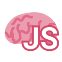
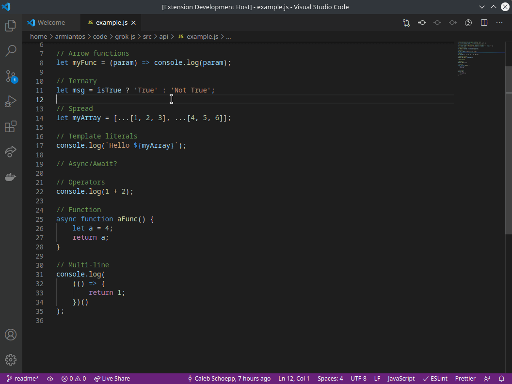
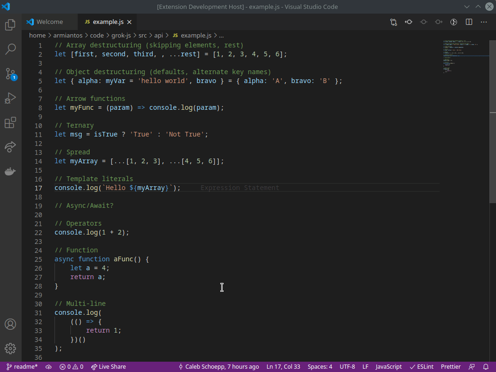
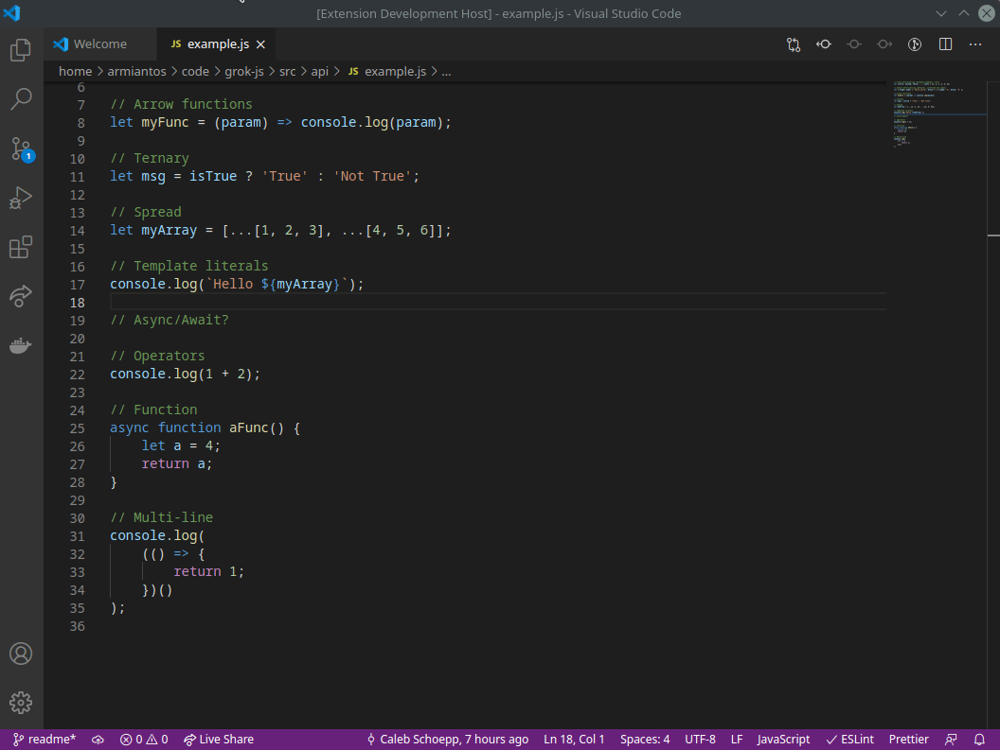
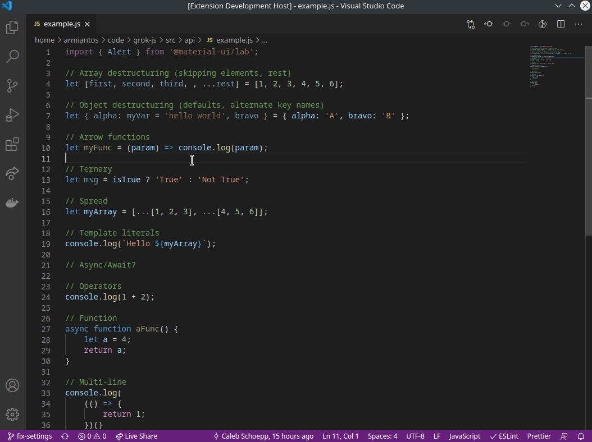

# GrokJS

<p align="center">
  
</p>

GrokJS helps you learn Javascript by reading code! Highlight the code segment you need help with and you'll be guided to relevant documentation.



## Inline hints

Hints about the current line will be shown inline to give you your best bet at Googling.



## Highlight and hover

Highlight and hover over a piece of your code for more information. A modal will give a thorough description of the syntax and a link to documentation.



## Settings

GrokJS has a number of settings that can be configured. These determine what style of JS code will be validly parsed.



## Motivation

Syntax can be a big stumbling block when learning a new language. Even worse, it is often difficult to seperate the syntax and semantics of a piece of code which makes Googling difficult. For example with the line of code below.

```js
const [message, setMessage] = useState("Hello world!");
```

If you don't know what [array destructuring](https://developer.mozilla.org/en-US/docs/Web/JavaScript/Reference/Operators/Destructuring_assignment#array_destructuring) is then you won't have much luck Googling to understand this code. You might find documentation for `useState` or for `setMessage` — but Google doesn't know you just want to understand the syntax.

GrokJS solves this problem by adding inline annotations about the syntax to the editor. And for when this is not enough you'll find links to informative documentation.


## Authors
- [Armianto Sumitro](https://github.com/armiantos)
- [Caleb Schoepp](https://github.com/calebschoepp)
- [Cyrus Diego](https://github.com/cyrusdiego)
- [Daniel Rojas-Cardona](https://github.com/drojasca)